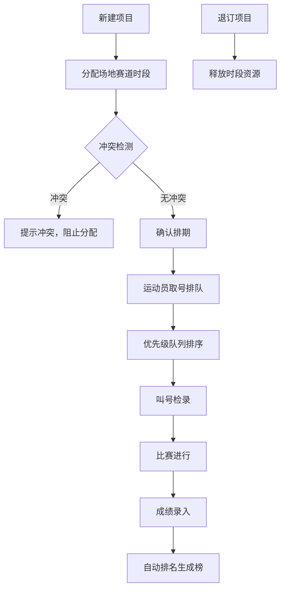

## 1. 产品概述

运动会项目编排管理系统，用于解决运动会场地赛道资源调度、项目冲突检测、运动员检录排队及成绩管理的核心问题。系统面向运动会组织者、裁判员和现场工作人员，提供高效、可视化的项目编排与检录管理能力。

核心价值：通过数字化管理避免场地赛道冲突，通过优先级队列机制实现灵活的检录调度，提升运动会组织效率和现场体验。

## 2. 核心功能

### 2.1 用户角色

| 角色 | 注册方式 | 核心权限 |
|------|----------|----------|
| 系统管理员 | 系统内置 | 场地赛道建档、项目管理、数据导出、系统配置 |
| 编排裁判 | 账号登录 | 赛道排期、冲突检测、项目退订、优先级调整 |
| 检录裁判 | 账号登录 | 取号排队、叫号检录、VIP插队处理、成绩录入 |
| 数据录入员 | 账号登录 | 成绩录入、排名查询 |

### 2.2 功能模块

1. **赛道排期模块**：场地赛道建档、排期日历视图、项目时段分配、项目信息管理
2. **冲突校验模块**：时段重叠自动检测、冲突高亮提示、退订时段释放、占用状态实时更新
3. **排队检录模块**：取号排队、队列叫号、检录状态管理、大屏显示
4. **优先插队模块**：优先级队列维护、VIP/加急插队处理、临时加项、队列重排序
5. **成绩管理模块**：成绩录入、自动排名、成绩榜展示

### 2.3 页面详情

| 页面名称 | 模块名称 | 功能描述 |
|---------|---------|----------|
| 首页仪表板 | 总览 | 今日项目概览、实时队列状态、冲突预警、快捷操作入口 |
| 赛道排期 | 赛道排期 | 场地赛道列表、日历/时间轴排期视图、项目新建/编辑/删除、时段分配表单 |
| 冲突中心 | 冲突校验 | 冲突列表展示、冲突详情、一键解决冲突、退订释放时段 |
| 检录大厅 | 排队检录 | 队列显示、叫号控制、检录状态切换、大屏显示模式 |
| 优先级管理 | 优先插队 | 优先级配置、VIP/加急插队操作、临时加项表单、队列拖拽排序 |
| 成绩管理 | 成绩管理 | 成绩录入表单、实时排名榜、项目成绩查询 |

## 3. 核心流程

### 3.1 赛道排期流程
管理员创建场地赛道信息 → 编排裁判为项目分配时段 → 系统自动检测时段冲突 → 无冲突则确认排期 → 有冲突则提示并阻止分配 → 退订项目后释放时段资源

### 3.2 检录排队流程
运动员到达检录处 → 检录裁判取号入队 → 系统按优先级排序队列 → 裁判叫号 → 运动员检录完成 → 进入比赛场地

### 3.3 优先插队流程
收到加急/VIP请求 → 选择优先级等级（VIP>加急>普通） → 插入队列对应位置 → 系统自动重排后续队列 → 实时更新显示

### 3.4 成绩录入流程
比赛结束 → 数据录入员录入各运动员成绩 → 系统自动计算排名 → 生成成绩榜 → 支持查询和导出

### 3.5 核心流程图

## 4. 用户界面设计

### 4.1 设计风格
- **主色调**：深海蓝 (#1e3a5f) - 专业、稳重
- **辅助色**：活力橙 (#ff7a00) - 强调、活力
- **成功色**：翡翠绿 (#10b981) - 正常、通过
- **警告色**：珊瑚红 (#ef4444) - 冲突、错误
- **背景**：浅灰蓝渐变 (#f0f4f8 至 #e2e8f0) - 清爽、现代
- **字体**：标题使用 "Chakra Petch" - 现代运动感；正文使用 "Noto Sans SC" - 清晰易读
- **按钮风格**：圆角 8px，悬停上浮微动画，主按钮使用渐变
- **卡片风格**：轻微阴影，悬停加深阴影，边框 1px 透明色
- **图标风格**：线性图标，来自 lucide-react

### 4.2 页面设计概述

| 页面名称 | 模块名称 | UI 元素 |
|---------|---------|---------|
| 首页仪表板 | 总览 | 统计卡片网格、实时队列滚动展示、冲突预警横幅、快捷操作按钮组、数据可视化图表 |
| 赛道排期 | 赛道排期 | 左侧赛道列表、右侧时间轴/日历视图、拖拽分配、模态框表单、状态标签 |
| 冲突中心 | 冲突校验 | 冲突卡片列表、冲突红边高亮、详情展开、解决操作按钮、时间线对比 |
| 检录大厅 | 排队检录 | 大号叫号显示屏、队列列表、状态指示、叫号控制按钮、全屏模式切换 |
| 优先级管理 | 优先插队 | 优先级规则说明、拖拽排序队列、插队操作面板、优先级徽章、临时加项表单 |
| 成绩管理 | 成绩管理 | 成绩录入表格、排名榜金色/银色/铜色高亮、排序筛选、成绩导出 |

### 4.3 动画与交互
- 页面加载：staggered 渐入动画，卡片依次上浮
- 叫号动画：数字放大脉冲效果，背景色闪烁
- 冲突提示：红色呼吸灯效果
- 拖拽排序：被拖拽元素放大半透明，放置位置高亮
- 按钮点击：scale 0.95 微缩反馈

### 4.4 响应式
- **桌面端优先**：1200px+ 完整布局，侧边栏 + 主内容区
- **平板端**：768px-1199px，侧边栏折叠为图标栏
- **移动端**：<768px，底部导航，单列布局，重要信息优先展示
- 所有可点击区域 ≥ 44x44px，支持触摸操作

### 4.5 无障碍设计
- 颜色对比度符合 WCAG AA 标准
- 所有交互元素支持键盘操作
- 重要状态变化有语音提示（可选）
- 表单有明确的错误提示和辅助文字
