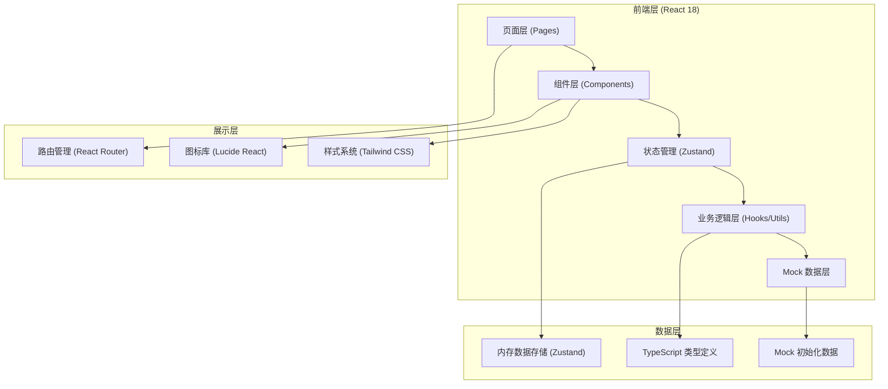
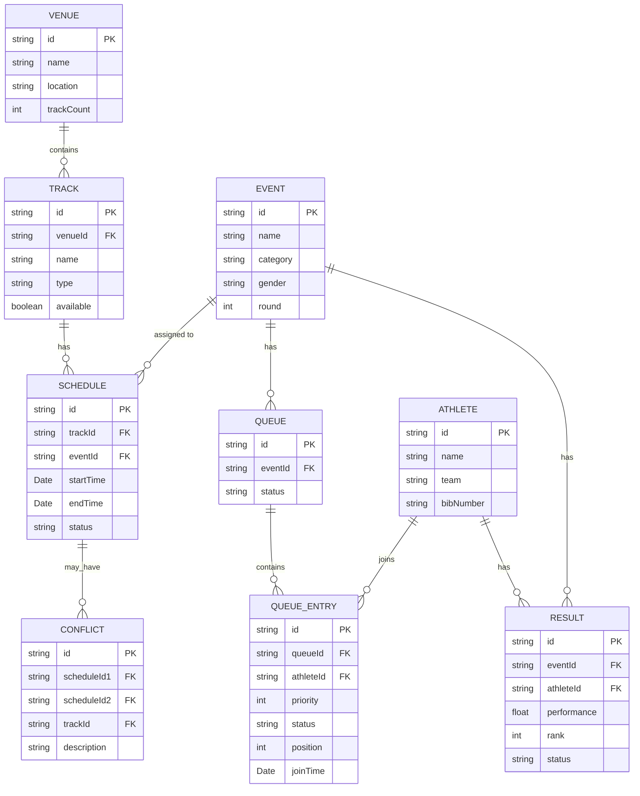

## 1. 架构设计



## 2. 技术描述

- **前端框架**: React 18 + TypeScript
- **构建工具**: Vite
- **路由管理**: react-router-dom v6
- **状态管理**: zustand
- **样式方案**: Tailwind CSS 3
- **图标库**: lucide-react
- **后端**: 无后端，纯前端 Mock 数据实现
- **数据持久化**: LocalStorage（可选）
- **包管理器**: npm

### 2.1 核心技术选型理由
- **React 18**: 成熟稳定，组件化开发，生态丰富
- **Zustand**: 轻量级状态管理，API 简洁，适合中小型应用
- **Tailwind CSS**: 快速开发，一致性好，响应式设计便捷
- **纯前端架构**: 演示项目无需后端，降低复杂度，可直接运行

## 3. 目录结构

```
.
├── src/
│   ├── components/          # 通用组件
│   │   ├── Layout.tsx       # 布局组件
│   │   ├── Sidebar.tsx      # 侧边栏导航
│   │   ├── StatusBadge.tsx  # 状态标签组件
│   │   ├── Modal.tsx        # 模态框组件
│   │   └── Button.tsx       # 按钮组件
│   ├── pages/               # 页面组件
│   │   ├── Dashboard.tsx    # 首页仪表板
│   │   ├── Schedule.tsx     # 赛道排期页
│   │   ├── Conflict.tsx     # 冲突中心页
│   │   ├── CheckIn.tsx      # 检录大厅页
│   │   ├── Priority.tsx     # 优先级管理页
│   │   └── Results.tsx      # 成绩管理页
│   ├── store/               # 状态管理
│   │   └── useAppStore.ts   # 全局状态
│   ├── types/               # 类型定义
│   │   └── index.ts         # 所有类型定义
│   ├── utils/               # 工具函数
│   │   ├── conflict.ts      # 冲突检测算法
│   │   ├── queue.ts         # 优先级队列算法
│   │   ├── time.ts          # 时间处理工具
│   │   └── mockData.ts      # Mock 数据生成
│   ├── App.tsx              # 应用根组件
│   ├── main.tsx             # 入口文件
│   └── index.css            # 全局样式
├── public/                  # 静态资源
├── index.html               # HTML 入口
├── vite.config.ts           # Vite 配置
├── tailwind.config.js       # Tailwind 配置
├── postcss.config.js        # PostCSS 配置
├── tsconfig.json            # TypeScript 配置
└── package.json             # 项目依赖
```

## 4. 路由定义

| 路由路径 | 页面名称 | 功能说明 |
|---------|---------|----------|
| / | 首页仪表板 | 今日项目概览、实时队列、冲突预警 |
| /schedule | 赛道排期 | 场地赛道管理、项目排期分配 |
| /conflict | 冲突中心 | 冲突检测、冲突列表、退订处理 |
| /checkin | 检录大厅 | 队列叫号、检录管理 |
| /priority | 优先级管理 | VIP插队、临时加项、队列排序 |
| /results | 成绩管理 | 成绩录入、排名榜展示 |

## 5. 数据模型

### 5.1 ER 图



### 5.2 TypeScript 类型定义

```typescript
// 优先级枚举
export enum Priority {
  VIP = 'vip',
  URGENT = 'urgent',
  NORMAL = 'normal'
}

// 状态枚举
export enum ScheduleStatus {
  SCHEDULED = 'scheduled',
  IN_PROGRESS = 'in_progress',
  COMPLETED = 'completed',
  CANCELLED = 'cancelled'
}

export enum QueueStatus {
  WAITING = 'waiting',
  CALLED = 'called',
  CHECKED_IN = 'checked_in',
  MISSED = 'missed'
}

export enum EntryStatus {
  PENDING = 'pending',
  RUNNING = 'running',
  FINISHED = 'finished',
  DISQUALIFIED = 'disqualified'
}

// 场地
export interface Venue {
  id: string;
  name: string;
  location: string;
  trackCount: number;
}

// 赛道
export interface Track {
  id: string;
  venueId: string;
  name: string;
  type: 'running' | 'field' | 'combined';
  available: boolean;
}

// 项目
export interface Event {
  id: string;
  name: string;
  category: 'track' | 'field' | 'combined';
  gender: 'male' | 'female' | 'mixed';
  round: number;
}

// 排期
export interface Schedule {
  id: string;
  trackId: string;
  eventId: string;
  startTime: Date;
  endTime: Date;
  status: ScheduleStatus;
}

// 冲突
export interface Conflict {
  id: string;
  scheduleId1: string;
  scheduleId2: string;
  trackId: string;
  description: string;
}

// 运动员
export interface Athlete {
  id: string;
  name: string;
  team: string;
  bibNumber: string;
}

// 检录队列
export interface QueueEntry {
  id: string;
  eventId: string;
  athleteId: string;
  athlete: Athlete;
  priority: Priority;
  status: QueueStatus;
  position: number;
  joinTime: Date;
  calledTime?: Date;
}

// 成绩
export interface Result {
  id: string;
  eventId: string;
  athleteId: string;
  athlete: Athlete;
  performance: number;
  unit: string;
  rank: number;
  status: EntryStatus;
  windSpeed?: number;
}

// 应用状态
export interface AppState {
  venues: Venue[];
  tracks: Track[];
  events: Event[];
  schedules: Schedule[];
  conflicts: Conflict[];
  athletes: Athlete[];
  queueEntries: QueueEntry[];
  results: Result[];
  currentCalledNumber: string | null;
}
```

## 6. 核心算法

### 6.1 冲突检测算法

```typescript
// 检测两个时段是否重叠
export function isTimeOverlap(
  start1: Date, end1: Date,
  start2: Date, end2: Date
): boolean {
  return start1 < end2 && start2 < end1;
}

// 检测同赛道是否有冲突
export function detectConflicts(
  schedules: Schedule[],
  newSchedule: Omit<Schedule, 'id'>
): Conflict[] {
  const conflicts: Conflict[] = [];
  const sameTrackSchedules = schedules.filter(
    s => s.trackId === newSchedule.trackId && 
         s.status !== ScheduleStatus.CANCELLED
  );
  
  for (const existing of sameTrackSchedules) {
    if (isTimeOverlap(
      existing.startTime, existing.endTime,
      newSchedule.startTime, newSchedule.endTime
    )) {
      conflicts.push({
        id: generateId(),
        scheduleId1: existing.id,
        scheduleId2: 'new',
        trackId: newSchedule.trackId,
        description: `时段重叠: ${formatTime(existing.startTime)}-${formatTime(existing.endTime)} 与 ${formatTime(newSchedule.startTime)}-${formatTime(newSchedule.endTime)}`
      });
    }
  }
  
  return conflicts;
}
```

### 6.2 优先级队列排序算法

```typescript
// 优先级权重
const PRIORITY_WEIGHT: Record<Priority, number> = {
  [Priority.VIP]: 0,
  [Priority.URGENT]: 1,
  [Priority.NORMAL]: 2
};

// 排序队列：先按优先级，再按加入时间
export function sortQueue(entries: QueueEntry[]): QueueEntry[] {
  return [...entries].sort((a, b) => {
    // 先比较优先级
    const priorityDiff = PRIORITY_WEIGHT[a.priority] - PRIORITY_WEIGHT[b.priority];
    if (priorityDiff !== 0) return priorityDiff;
    
    // 优先级相同则比较加入时间
    return a.joinTime.getTime() - b.joinTime.getTime();
  }).map((entry, index) => ({
    ...entry,
    position: index + 1
  }));
}

// 插队：插入到指定位置
export function insertWithPriority(
  queue: QueueEntry[],
  newEntry: QueueEntry
): QueueEntry[] {
  const sorted = sortQueue([...queue, newEntry]);
  return updatePositions(sorted);
}

// 更新位置编号
function updatePositions(entries: QueueEntry[]): QueueEntry[] {
  return entries.map((entry, index) => ({
    ...entry,
    position: index + 1
  }));
}
```

## 7. 状态管理设计

### 7.1 Zustand Store 结构

```typescript
import { create } from 'zustand';

interface AppStore extends AppState {
  // 赛道排期操作
  addVenue: (venue: Omit<Venue, 'id'>) => void;
  addTrack: (track: Omit<Track, 'id'>) => void;
  addEvent: (event: Omit<Event, 'id'>) => void;
  createSchedule: (schedule: Omit<Schedule, 'id'>) => { success: boolean; conflicts?: Conflict[] };
  cancelSchedule: (scheduleId: string) => void;
  
  // 冲突检测
  checkAllConflicts: () => Conflict[];
  resolveConflict: (conflictId: string, keepScheduleId: string) => void;
  
  // 队列操作
  addToQueue: (entry: Omit<QueueEntry, 'id' | 'position' | 'joinTime' | 'status'>) => void;
  callNextNumber: (eventId: string) => QueueEntry | null;
  updateQueueStatus: (entryId: string, status: QueueStatus) => void;
  insertWithPriority: (entry: Omit<QueueEntry, 'id' | 'position' | 'joinTime' | 'status'>, priority: Priority) => void;
  
  // 成绩操作
  addResult: (result: Omit<Result, 'id' | 'rank'>) => void;
  calculateRanks: (eventId: string) => void;
  
  // 初始化
  initializeMockData: () => void;
}

export const useAppStore = create<AppStore>((set, get) => ({
  // ... 状态初始值
  
  // ... 各方法实现
}));
```

## 8. Mock 数据设计

初始化时生成以下 Mock 数据：
- 2 个场地（主体育场、副场）
- 8 条赛道（跑道 6 条 + 田赛场地 2 个）
- 15 个运动项目（短跑、中长跑、跳跃、投掷等）
- 30 条排期（含 2-3 个冲突用于演示）
- 50 名运动员
- 20 条队列数据
- 10 条已录入成绩

## 9. 开发规范

- 组件文件使用 `.tsx` 扩展名
- 每个组件不超过 300 行，复杂组件拆分
- 使用 TypeScript 严格模式
- 命名规范：组件 PascalCase，变量 camelCase，常量 UPPER_SNAKE_CASE
- 使用 `@/` 别名引用 `src` 目录
- 禁止使用 `any` 类型
- 组件默认导出
- 所有用户输入做验证
